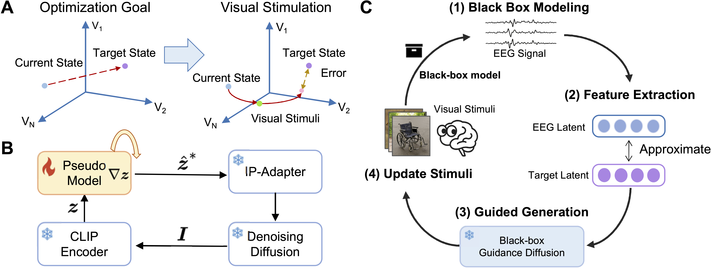

<div align="center">

<h1>MindPilot</h1>

<h3>Closed-loop Visual Stimulation Optimization for Brain Modulation with EEG-guided Diffusion</h3>

[](https://openreview.net/forum?id=7jdmXx869Q)
[](https://www.python.org/downloads/release/python-3100/)
[](https://pytorch.org/)
[](LICENSE)
[](https://huggingface.co/datasets/LidongYang/Mindpilot)

---

</div>

## 📰 News

- 🚀 **2026.03.08**: We update the codebase and [Hugging Face](https://huggingface.co/datasets/LidongYang/Mindpilot) resources.
- 📄 **2026.02.11**: We update the [arXiv](https://arxiv.org/abs/2602.10552) paper and release the code repository.
- 🎉 **2026.01.26**: Our paper is accepted to [ICLR 2026](https://openreview.net/forum?id=7jdmXx869Q).

## 📖 Overview

We propose **MindPilot**, which employs a simple black-box optimization approach to achieve EEG-guided closed-loop visual stimulation optimization (supporting offline learning data and experience replay) for regulating the brain activity of subjects. This paper addresses three problems: high-noise non-invasive brain signals; the non-differentiability of brain input and output; and the variability of brain activity states.

<!-- ### ✨ Key Features

- 🔄 **Closed-loop Optimization**: Real-time EEG feedback for iterative visual stimuli refinement
- 🎨 **Diffusion-based Generation**: Leveraging state-of-the-art diffusion models for high-quality image generation
- 🧪 **Two Optimization Strategies**: 
  - Interactive Search: Evolutionary search in the latent space
  - Heuristic Generation: Gradient-based optimization with EEG guidance
- 🧠 **Multiple Brain Features**: Support for EEG latent features, PSD features, and custom brain signals
- 📊 **Comprehensive Validation**: Tested on multiple emotion datasets (THINGS-EEG2, ArtPhoto, GAPED, EmoSet)
- 🖥️ **Real-time Deployment**: Client-server architecture for online human experiments

--- -->

## 🎯 Conceptualization

<div align="center">

<p><i>The conceptualization of MindPilot: Closed-loop optimization of visual stimuli using EEG feedback</i></p>
</div>

---

## 🏗️ Architecture

<div align="center">

<p><i>Overall architecture of MindPilot framework</i></p>
</div>


### Installation

#### Option 1: Quick Setup (Recommended)

```bash
cd MindPilot
chmod +x setup.sh
./setup.sh
conda activate MindPilot
```


#### Option 2: Manual Setup

```bash
conda env create -f environment.yml
conda activate MindPilot
```


---

## 📦 Pretrained Weights & Datasets

We provide pretrained model weights and preprocessed datasets on Hugging Face:

🤗 **[https://huggingface.co/datasets/LidongYang/Mindpilot](https://huggingface.co/datasets/LidongYang/Mindpilot)**

You can download using the Hugging Face CLI:

```bash
# Install huggingface_hub if not already installed
pip install huggingface_hub

# Download all files
huggingface-cli download LidongYang/Mindpilot --repo-type dataset --local-dir ./data
```

### External Datasets

Download the additional datasets from the following sources:

| Dataset | Description | Download Link |
|:-------:|:------------|:--------------|
| **THINGS-EEG2** | Natural images with EEG responses | [OSF](https://osf.io/3jk45/) |
| **ArtPhoto** | Artistic photographs with emotion ratings | [ImageEmotion](https://www.imageemotion.org) |
| **GAPED** | Geneva Affective Picture Database | [UNIGE](https://www.unige.ch/cisa/research/materials-and-online-research/research-material/) |
| **EmoSet** | Large-scale emotion dataset | [VCC Tech](https://vcc.tech/EmoSet) |


---

## 🎓 Usage

### 1. Train EEG Readout Model

Train a neural network to predict EEG responses from visual features:

```bash
python model/end_to_end.py \
    --dnn alexnet \
    --sub 10 \
    --modeled_time_points all \
    --pretrained False \
    --epochs 50 \
    --lr 1e-5 \
    --weight_decay 0. \
    --batch_size 64 \
    --save_trained_models True \
    --project_dir eeg_encoding/
```


### 2. Interactive Search

Perform evolutionary search in the latent space for optimal stimuli:

```bash
jupyter notebook experiments/exp-interactive_search.ipynb
```


### 3. Heuristic Generation

Generate optimized visual stimuli using gradient-based optimization:

```bash
python experiments/exp-heuristic_generation_with_guidance_anyfeature.py
```

### 4. Benchmark Evaluation

#### Offline Generation Benchmark
```bash
bash experiments/run_benchmark_offline_generation.sh
```

#### Heuristic Generation Benchmark
```bash
bash experiments/run_benchmark_heuristic_generation.sh
```

#### Complete Benchmark Suite
```bash
bash experiments/run_benchmark_total.sh
```

### 5. Real-time Human Experiments

**Server side (runs optimization):**
```bash
python server/improved_experiment.py --port 5000
```

**Client side (presents stimuli and records EEG):**
```bash
python client/client.py --server_ip 192.168.1.100 --port 5000
```

## 📜 License

This project is licensed under the [MIT License](LICENSE).

## 📝 Citation

If you find this work useful, please cite our paper:

```bibtex
@inproceedings{
2026mindpilot,
title={MindPilot: Closed-loop Visual Stimulation Optimization for Brain Modulation with {EEG}-guided Diffusion},
author={Dongyang Li, Kunpeng Xie, Mingyang Wu, Yiwei Kong, Jiahua Tang, Haoyang Qin, Chen Wei, Quanying Liu },
booktitle={The Fourteenth International Conference on Learning Representations},
year={2026},
url={https://openreview.net/forum?id=7jdmXx869Q}
}
```
